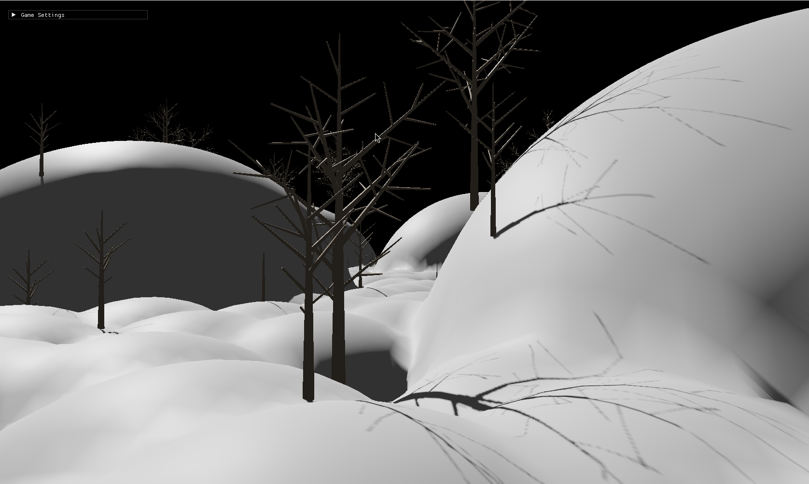

# Big Eyes

It's a game engine - how so? It has shadowmapping 😀



### Objectives


### Building

Requires Zig 0.14.0

```
zig build glfw-run --release=small
```

Currently debug and safe builds fail.

### Cool Features


## NodeGraph

Lazy execution of functions
* Alternative to Entity Component Systems or GameObject/Behaviour for coordinating gameplay logic
  * Instead of managing a pool of entities, your game loop can be thought of as a data pipeline
  * Your gameplay elements are kept in strict types and can be wired into singleton nodes for different gameplay systems
  * The input of the graph is user input, system events (time, disk, job results)
  * The output of the graph is mesh data, graphics updates, job requests
* At `comptime`, nodes are wired up to each other, and their inputs and outputs validated for correctness
* At runtime, the nodes will only execute the internal function if the inputs have changed (dirty)
  * Optionally, the nodes can also run change detection on their outputs to determine if they're dirty
* Optimized for ultra-low-latency!
  * Inputs to the node graph can be polled late, allowing for the freshest user inputs for button presses
  * Outputs to the node graph can be submitted early, to get ahead of the main graphics render for mesh/instance/texture/buffer updates

## Realtime Subdivision Surface on Meshes

Performant enough to run during game loop, can be run after armature deformations, allowing for smooth toon-like characters without needing super granular vertex weighting

## Natural Detail v3 

v1 - Call back to my first cpp project :) - https://www.youtube.com/watch?v=rmxJNBdGSkk

 *(previous v2 version was for a game company)*

Spawns trees (and other things) deterministically in a cascade of grids, from low density large models, to high-density small models.
Feature shared with terrain stamps, where the whole world can be made of procedural stamps (broad mountain stamps, hill stamps, finer grain texture stamps)

In future:
* Small models can be affected by the locations of large models (less grass around trees, more sticks and saplings)
* Grid of cascades spawns indefinitely into the distance where you go, where larger cascades spawn farther and smaller cascades stay closer (grass up-close, large trees seen in the distance)

## Custom Blender Export

* Ensure your blender is in the path
** Flatpak version currently doesn't work
```
blender triangle_wgpu_content/cube.blend --background --python .\tools\custom-gltf.py
```
This is automatically executed from the build script!

## Zig->Typescript Node Types
`zig run src/tool_game_build_type_definitions.zig`
Currently these are unused, as I've gone to a native entrypoint, instead of web.
